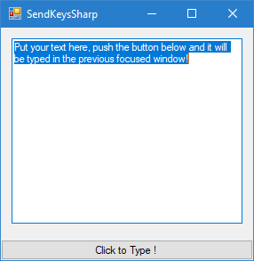

Send Keys Sharp
===============

This is a simple Windows C# tool that "types" text on other applications.

It's purpose is to "paste" text on windows in which Copy Paste does not work.

Examples are Remote Desktop, VmWare Console though the browser, Cisco Citrix VDI, etc...

Please remember you can download a binary from https://github.com/marcosdiez/sendkeyssharp/releases

Screenshot
----------

Building
---------

If you plan to Build this app yourself, you will need
michaelnoonan's inputsimulator with my extra pull request.

Please download it from here: https://github.com/michaelnoonan/inputsimulator/pull/48

Other than that, just use Visual Studio Community Edition
